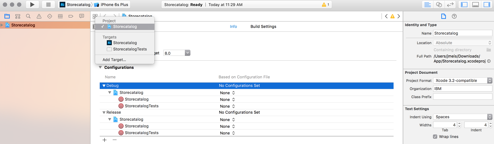

# Adding a new Datasource
This directory contains instructions on how to change the Mobile Dashboard Store Catalog iOS application's datasource to a customized backend on Bluemix.

### Before you begin
Ensure that you have:
* [Xcode](https://itunes.apple.com/us/app/xcode/id497799835?mt=12) Version >= 7.3
* [CocoaPods](https://cocoapods.org/) Version >= 1.0.0

  `sudo gem install cocoapods`

### Remove the current project configuration
1. Open project with Xcode
2. Select the project in left navigator
3. Select the info tab in your project
4. Select **None** for all configurations options




### Add BMS Core using CocoaPods
1. Open terminal and navigate to app path
2. Create the pod file typing `pod init`
3. Edit the pod file, replacing "Storecatalog" by your project name:

[**Podfile**](Podfile)

```ruby
platform :ios, '8.0'
use_frameworks!

target 'Storecatalog' do
    pod 'BMSCore', '~> 1.0'
end

target 'StorecatalogTests' do

end

# keeping the current configuration
post_install do |installer|
    installer.pods_project.targets.each do |target|
        puts "Updating #{target.name} OTHER_LDFLAGS"
        target.build_configurations.each do |config|
            xcconfig_path = config.base_configuration_reference.real_path
            xcconfig = File.read(xcconfig_path)
            new_xcconfig = xcconfig.sub('OTHER_LDFLAGS = $(inherited)', 'OTHER_LDFLAGS = $(inherited) -ObjC -l"xml2" -l"sqlite3" -l"z" -framework "CoreGraphics" -framework "CoreText" -framework "ImageIO" -framework "MediaPlayer" -framework "MobileCoreServices" -framework "QuartzCore" -framework "Security" -framework "SystemConfiguration" -framework "MapKit"')
            File.open(xcconfig_path, "w") { |file| file << new_xcconfig }
        end
    end
end
```

### Install pods
Type `pod install` in your terminal.

A file **.xcworkspace** will be created in your project path. Open it in Xcode.

### Create API Connect datasource

#### Create a Swift bridge class
In Xcode, create a **BMSRestClient.swift** file in the Datasources folder at IOSApp with the following content (**accept the creation of the Swift bridging header**), replacing the appRoute, appGuide, and bluemixRegion with current values for your backend. These values can be recovered by navigating to your **Mobile Client Access** service instance on Bluemix and clicking the **Mobile Options** button:

[**BMSRestClient.swift**](BMSRestClient.swift)

```Swift
import Foundation
import BMSCore

public class BMSRestClient: NSObject {
    // CHANGE CREDENTIALS HERE
    public static let appRoute = "REPLACE APP ROUTE INSIDE QUOTES"
    public static let appGuid = "REPLACE APP GUID INSIDE QUOTES"
    // Change the region if you are outside of the US
    public static let bluemixRegion = BMSClient.REGION_US_SOUTH

    public override init() {
        BMSClient.sharedInstance
            .initializeWithBluemixAppRoute(BMSRestClient.appRoute,
                                           bluemixAppGUID: BMSRestClient.appGuid,
                                           bluemixRegion: BMSRestClient.bluemixRegion)
    }

    public func get(url: String, parameters: NSDictionary?, success: ((NSArray) -> Void), failure: ((NSError?) -> Void)) {
        var queryParameters = [String : String]()
        for (key, value) in parameters! {
            queryParameters[key as! String] = value as? String
        }

        let request = Request(url: url,
                                   headers: nil,
                                   queryParameters: queryParameters,
                                   method: .GET,
                                   timeout: 30,
                                   cachePolicy: .ReloadIgnoringLocalAndRemoteCacheData)

        request.sendWithCompletionHandler { (response, error) in
            if let error = error {
                failure(error)
            }
            else if let data = response?.responseData {
                do {
                    let jsonResult = try NSJSONSerialization.JSONObjectWithData(data, options: .MutableContainers)
                    if jsonResult is NSArray {
                        success(jsonResult as! NSArray)
                    }
                    else {
                        success(NSArray(object: jsonResult))
                    }

                } catch let jsonError as NSError {
                    failure(jsonError)
                }
            }
            else {
                success(NSArray())
            }
        }
    }
}
```

#### Compile project
The Objective-C classes are generated automatically.

#### Create a API Connect datasource implementation using the previous class
Create **APIConnectBMSDatasource.h** and **APIConnectBMSDatasource.m** files in the Datasources folder. Replace "Storecatalog" in the Swift import clause by your current project name:

[**APIConnectBMSDatasource.h**](APIConnectBMSDatasource.h)

```objectivec
#import <Foundation/Foundation.h>
#import "RODatasource.h"
#import "ROPagination.h"

@protocol ROSearchable;

@interface APIConnectBMSDatasource : NSObject <RODatasource, ROPagination>

@property (nonatomic, assign) Class objectsClass;
@property (nonatomic, strong) NSString *urlString;
@property (nonatomic, strong) NSString *resourceId;
@property (nonatomic, strong) NSObject<ROSearchable> *delegate;
@property (nonatomic, strong) NSString *searchField;

- (instancetype)initWithUrlString:(NSString *)urlString
                       resourceId:(NSString *)resourceId
                     objectsClass:(__unsafe_unretained Class)objectsClass;

+ (instancetype)datasourceWithUrlString:(NSString *)urlString
                             resourceId:(NSString *)resourceId
                           objectsClass:(__unsafe_unretained Class)objectsClass;

@end
```

[**APIConnectBMSDatasource.m**](APIConnectBMSDatasource.m)

```objectivec
#import "APIConnectBMSDatasource.h"
#import "ROOptionsFilter.h"
#import "ROError.h"
#import "ROFilter.h"
#import "NSString+RO.h"
#import "ROSearchable.h"
#import "Storecatalog-Swift.h"
#import "NSDictionary+RO.h"

@interface APIConnectBMSDatasource ()

@property (nonatomic, strong) BMSRestClient *restClient;

@end

@implementation APIConnectBMSDatasource

static NSString *const kAPIConnectBMSConditionsParam       = @"filter";
static NSString *const kAPIConnectBMSSortParam             = @"order";
static NSString *const kAPIConnectBMSSkipParam             = @"skip";
static NSString *const kAPIConnectBMSLimitParam            = @"limit";
static NSString *const kAPIConnectBMSDistinctParam         = @"distinct";
static NSInteger const kAPIConnectBMSDataPageSize          = 20;

- (instancetype)initWithUrlString:(NSString *)urlString resourceId:(NSString *)resourceId objectsClass:(__unsafe_unretained Class)objectsClass {
    self = [super init];
    if (self) {
        _urlString = urlString;
        _resourceId = resourceId;
        _objectsClass = objectsClass;
        _restClient = [BMSRestClient new];
    }
    return self;
}

+ (instancetype)datasourceWithUrlString:(NSString *)urlString resourceId:(NSString *)resourceId objectsClass:(__unsafe_unretained Class)objectsClass {
    return [[self alloc] initWithUrlString:urlString
                                resourceId:resourceId
                              objectsClass:objectsClass];
}

#pragma mark - <RODatasource>

- (void)loadOnSuccess:(RODatasourceSuccessBlock)successBlock onFailure:(RODatasourceErrorBlock)failureBlock {
    [self loadWithOptionsFilter:nil onSuccess:successBlock onFailure:failureBlock];
}

- (void)loadWithOptionsFilter:(ROOptionsFilter *)optionsFilter onSuccess:(RODatasourceSuccessBlock)successBlock onFailure:(RODatasourceErrorBlock)failureBlock {
    NSMutableDictionary *requestParams = [self requestParams:optionsFilter];
    NSString *restAPIURL = [self.urlString stringByAppendingString:self.resourceId];

    [self.restClient get:restAPIURL parameters:requestParams success:^(NSArray *response) {
        if (successBlock) {
            NSMutableArray *responseArray = [response mutableCopy];
            NSMutableArray *itemArray = [[NSMutableArray alloc] init];

            for (NSDictionary *dic in responseArray) {
                [itemArray addObject:[[self.objectsClass alloc] initWithDictionary:dic]];
            }

            dispatch_async(dispatch_get_main_queue(), ^{
                successBlock(itemArray);
            });
        }

    } failure:^(NSError *error) {
        if (failureBlock) {
            dispatch_async(dispatch_get_main_queue(), ^{
                failureBlock(error, nil);
            });
        }
    }];
}

- (void)distinctValues:(NSString *)columnName filters:(NSArray *)filters onSuccess:(RODatasourceSuccessBlock)successBlock onFailure:(RODatasourceErrorBlock)failureBlock {
    ROOptionsFilter *optionsFilter = [ROOptionsFilter new];
    optionsFilter.pageSize = @100000;
    optionsFilter.baseFilters = [NSMutableArray arrayWithArray:filters];

    NSMutableDictionary *requestParams = [self requestParams:optionsFilter];
    NSString *restAPIURL = [self.urlString stringByAppendingString:self.resourceId];

    [self.restClient get:restAPIURL parameters:requestParams success:^(NSArray * response) {
        if (successBlock) {
            NSMutableArray *objects = [NSMutableArray new];
            for (NSDictionary *dic in response) {
                NSString *value = [dic ro_stringForKey:columnName];
                if (value && ![objects containsObject:value]) {
                    [objects addObject:value];
                }
            }

            dispatch_async(dispatch_get_main_queue(), ^{
                successBlock(objects);
            });
        }

    } failure:^(NSError * error) {
        if (failureBlock) {
            dispatch_async(dispatch_get_main_queue(), ^{
                failureBlock(error, nil);
            });
        }
    }];
}

- (NSString *)imagePath:(NSString *)path {
    return path;
}

#pragma mark - <ROPagination>

- (NSInteger)pageSize {
    return kAPIConnectBMSDataPageSize;
}

- (void)loadPageNum:(NSInteger)pageNum onSuccess:(RODatasourceSuccessBlock)successBlock onFailure:(RODatasourceErrorBlock)failureBlock {
    [self loadPageNum:pageNum withOptionsFilter:nil onSuccess:successBlock onFailure:failureBlock];
}

- (void)loadPageNum:(NSInteger)pageNum withOptionsFilter:(ROOptionsFilter *)optionsFilter onSuccess:(RODatasourceSuccessBlock)successBlock onFailure:(RODatasourceErrorBlock)failureBlock {
    if (!optionsFilter) {
        optionsFilter = [ROOptionsFilter new];
    }

    NSInteger size = optionsFilter.pageSize ? [optionsFilter.pageSize integerValue] : [self pageSize];
    NSInteger skip = pageNum * size;
    [optionsFilter.extra setObject:@(skip)
                            forKey:kAPIConnectBMSSkipParam];

    [optionsFilter.extra setObject:@(size)
                            forKey:kAPIConnectBMSLimitParam];

    [self loadWithOptionsFilter:optionsFilter onSuccess:successBlock onFailure:failureBlock];
}

#pragma mark - Private methods

- (NSMutableDictionary *)requestParams:(ROOptionsFilter *)optionsFilter {
    NSMutableDictionary *requestParams = [NSMutableDictionary dictionaryWithDictionary:optionsFilter.extra];

    NSMutableArray *exps = [NSMutableArray new];
    NSArray *searchableFields;

    if (self.searchField) {
        searchableFields = [NSArray arrayWithObject:self.searchField];

    } else {
        if (self.delegate) {
            searchableFields = [self.delegate searchableFields];
        } else {
            searchableFields = [NSArray new];
        }
    }

    if (searchableFields && searchableFields.count > 0 && optionsFilter.searchText) {
        NSMutableArray* searches = [NSMutableArray new];
        for (int i = 0; i < searchableFields.count; i++) {
            [searches addObject:[NSString stringWithFormat:@"{\"%@\":{\"like\":\"%@\"}}",
                                 searchableFields[i],
                                 optionsFilter.searchText
                                 ]];
        }
        [exps addObject:[NSString stringWithFormat:@"\"or\":[%@]",
                         [searches componentsJoinedByString:@","]]];
    }

    for (NSObject<ROFilter> *filter in optionsFilter.filters) {
        NSString *qs = [filter getQueryString];
        if (qs) {
            [exps addObject:[qs stringByReplacingOccurrencesOfString:@"$in" withString:@"inq"]];
        }
    }

    if (optionsFilter.baseFilters && optionsFilter.baseFilters.count != 0) {
        NSMutableArray *baseFilters = [NSMutableArray new];
        for (NSObject<ROFilter> *filter in optionsFilter.baseFilters) {
            NSString *qs = [filter getQueryString];
            if (qs) {
                [baseFilters addObject:[NSString stringWithFormat:@"{%@}", qs]];
            }
        }
        if (baseFilters.count != 0) {
            [exps addObject:[NSString stringWithFormat:@"\"$and\":[%@]",
                             [baseFilters componentsJoinedByString:@","]]];
        }
    }

    NSMutableString *where = [NSMutableString new];
    if (exps.count > 0) {
        [where appendFormat:@"{%@}", [exps componentsJoinedByString:@","]];

        [where replaceOccurrencesOfString:@"{\"$regex\":"
                               withString:@""
                                  options:NSLiteralSearch
                                    range:NSMakeRange(0, [where length])];

        [where replaceOccurrencesOfString:@",\"$options\":\"i\"}"
                               withString:@""
                                  options:NSLiteralSearch
                                    range:NSMakeRange(0, [where length])];
    }

    if (optionsFilter.sortColumn) {
        NSString *sortParam = [NSString stringWithFormat:@",\"%@\":\"%@ %@\"", kAPIConnectBMSSortParam, optionsFilter.sortColumn, optionsFilter.sortAscending ? @"ASC" : @"DESC"];
        [where appendString:sortParam];
    }

    for (NSString *key in optionsFilter.extra) {
        [where appendFormat:@",\"%@\":%@", key, [optionsFilter.extra objectForKey:key]];
    }

    [requestParams setObject:[NSString stringWithFormat:@"{\"where\":%@}", [where stringByReplacingOccurrencesOfString:@"$" withString:@""]]
                      forKey:kAPIConnectBMSConditionsParam];

    return requestParams;
}

@end
```

### Modify ProductDS using the previous datasource
Now we are going to modify **ProductsDS.h** and **ProductsDS.m** to use the new datasource. Replace "Storecatalog" in the Swift import clause by your current project name:

[**ProductsDS.h**](ProductsDS.h)

```objectivec
#import "RORestDatasource.h"
#import "ROSearchable.h"
#import "APIConnectBMSDatasource.h"

@interface ProductsDS : APIConnectBMSDatasource <ROSearchable>

@end
```

[**ProductsDS.m**](ProductsDS.m)

```objectivec
#import "ProductsDS.h"
#import "ROUtils.h"
#import "NSString+RO.h"
#import "ProductsDSItem.h"
#import "Storecatalog-Swift.h"

@implementation ProductsDS

static NSString *const kResourceId = @"/api/Products";

- (instancetype)init {
    self = [super initWithUrlString:BMSRestClient.appRoute
                         resourceId:kResourceId
                       objectsClass:[ProductsDSItem class]];
    if (self) {
        self.delegate = self;
    }

    return self;
}

- (NSString *)imagePath:(NSString *)path {
    if ([path isUrl]) {
        return path;
    }

    return [NSString stringWithFormat:@"%@%@", BMSRestClient.appRoute, path];
}

#pragma mark - <ROSearchable>

- (NSArray *)searchableFields {
    return @[kProductsDSItemName, kProductsDSItemDescription, kProductsDSItemCategory, kProductsDSItemPrice, kProductsDSItemRating, kProductsDSItemId];
}

@end

```

### Run the Store Catalog application in Xcode

Compile and run the Store Catalog application.

All of the code updates that we've just made should have the Store Catalog application now retrieving data from our customized backend on Bluemix.

> **Note:** If you update the images in your customized backend, the old pictures may still be cached in your emulator or device. Make sure you reset the device to ensure the new images are being added to the Store Catalog. Also, at this time, you will have to restart your Bluemix application when you redeploy data to the **Cloudant NoSQL DB** database. This is because **API Connect** needs to reconnect to your datasource.

### Future work

We are working to remove these manual steps in future releases of the new Mobile experience. In addition, we are working on better code generation in the Swift programming language for enhanced readability and improved support with our new Swift Client SDKs.

Stay tuned for updates.
