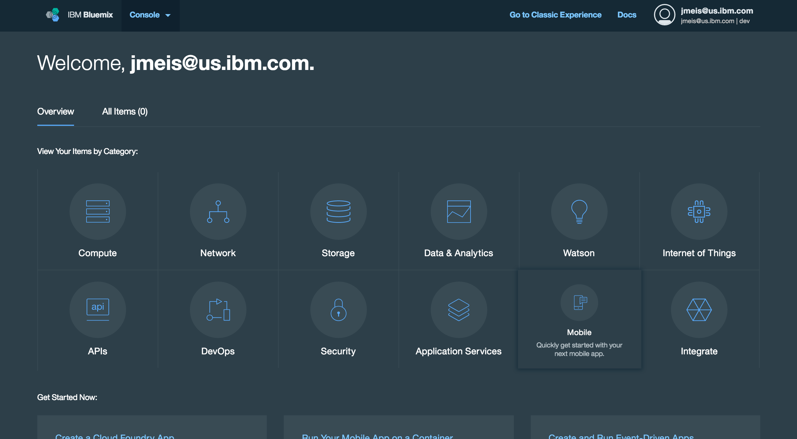

# Mobile Client for Bluemix

### IBM Mobile Dashboard Store Catalog iOS application
The Store Catalog Mobile Client provides instructions for how to integrate a **Bluemix Mobile** iOS Store Catalog application into your own [customized backend on Bluemix](https://github.com/ibm-bluemix-mobile-services/appbuilder-storecatalog-backend).

The backend uses the following IBM Bluemix services and runtime:

**Runtime**
* **API Connect** for a single point of REST integration using Loopback with Node.js

**Services**
* **Cloudant NoSQL DB** to hold a list products in a NoSQL database
* **Object Storage** to store product images
* **Mobile Client Access** for protecting resources
* **Push Notifications** for sending notifications to customers
* **Mobile Analytics** for monitoring trends and performance of the application

### Data architecture

## Getting started

The repository has a [datasources/](datasources) folder which shows how to modify the Store Catalog iOS application to retrieve data from your custom backend using **API Connect** as a single point of REST integration connected to the **Cloudant NoSQL DB** and **Object Storage** services on Bluemix

### Before you begin
Ensure that you have:

* Provisioned your own [customized backend on Bluemix](https://github.com/ibm-bluemix-mobile-services/mobiledashboard-storecatalog-backend)

### Create the Mobile Dashboard Store Catalog iOS application

Click the Try **Try Bluemix** button to get started:

1. Navigate to the Mobile area of Bluemix

	

2. Click New Project button

	

3. Select the Store Catalog template

	

4. Design the application

	

5. Get the source code for iOS

	

6. Run the Store Catalog application in Xcode

	

### Next steps:

Follow instructions in [datasources/](datasources) to change the datasource to your custom backend and retrieve data from **Cloudant NoSQL DB** and **Object Storage** services through **API Connect**.

### License
This package contains sample code provided in source code form. The samples are licensed under the Apache License, Version 2.0 (the "License"). You may obtain a copy of the License at http://www.apache.org/licenses/LICENSE-2.0 and may also view the license in the license file within this package.
