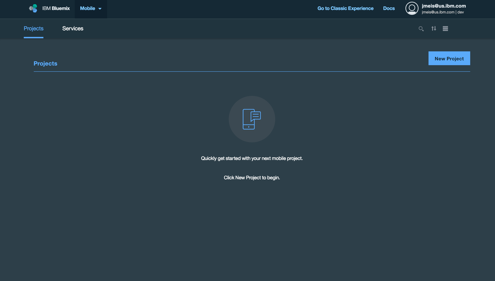
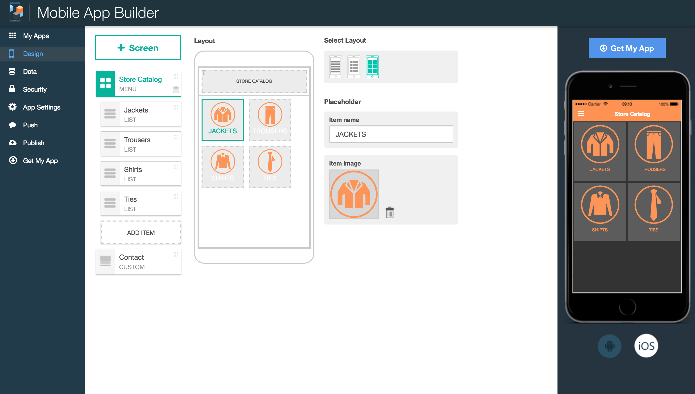
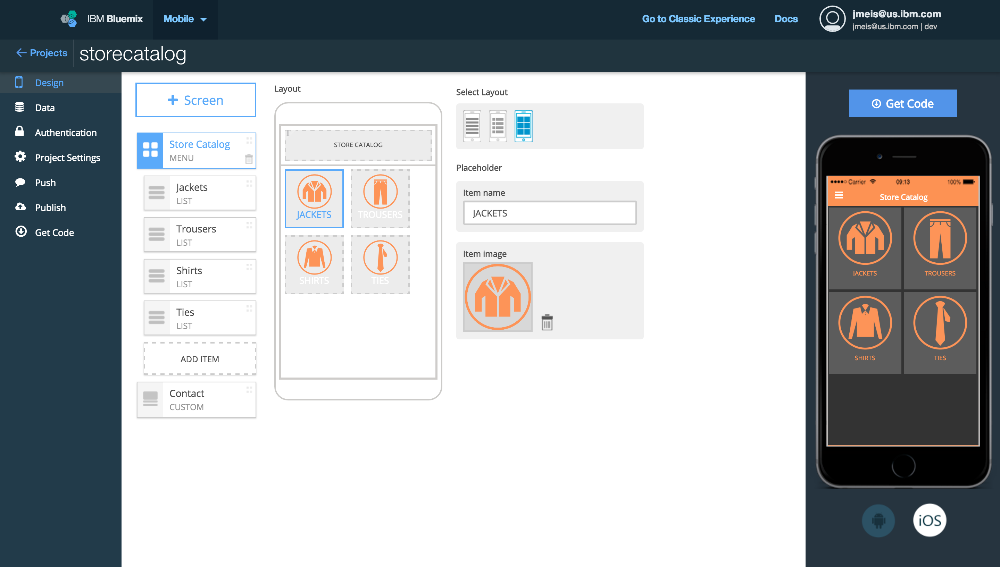
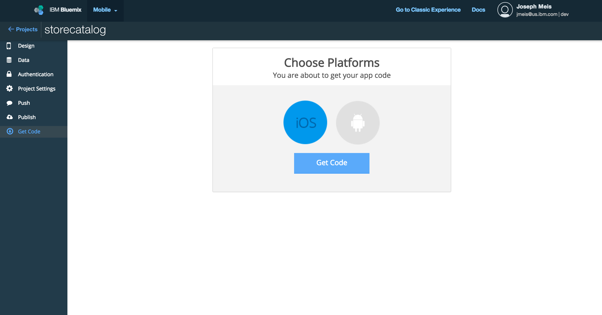

# Mobile Client for Bluemix

### IBM Mobile App Builder Store Catalog iOS application
The Store Catalog Mobile Client provides instructions for how to integrate a **Mobile App Builder** iOS Store Catalog application into your own [customized backend on Bluemix](https://github.com/ibm-bluemix-mobile-services/appbuilder-storecatalog-backend).

The backend uses the following IBM Bluemix services and runtime:

**Runtime**
* **API Connect** for a single point of REST integration using Loopback with Node.js

**Services**
* **Cloudant NoSQL DB** to hold a list products in a NoSQL database
* **Object Storage** to store product images
* **Mobile Client Access** for protecting resources using Facebook authentication
* **Push Notifications** for sending notifications to customers
* **Mobile Analytics** for monitoring trends and performance of the application

### Data architecture

## Getting started

The repository has two folders:

1. The [datasources/](datasources) folder shows how to modify the Store Catalog iOS application to retrieve data from your custom backend using **API Connect** as a single point of REST integration connected to the **Cloudant NoSQL DB** and **Object Storage** services on Bluemix

2. The [mobileservices/](mobileservices) folder shows how to add the **Mobile Client Access**, **Push Notifications**, and **Mobile Analytics** services to your iOS application

### Before you begin
Ensure that you have:

* Provisioned your own [customized backend on Bluemix](https://github.com/ibm-bluemix-mobile-services/appbuilder-storecatalog-backend)

### Create the Mobile App Builder Store Catalog iOS application

Click the Try **Mobile App Builder** button to get started:

2. Select the Store Catalog Template

	

3. Design the application

	

4. Get the source code for iOS

	

5. Run the Store Catalog application in Xcode

	

### Next steps:

1. Follow instructions in [datasources/](datasources) to change the datasource to your custom backend and retrieve data from **Cloudant NoSQL DB** and **Object Storage** services through **API Connect**

2. Follow instructions in [mobileservices/](mobileservices) to add the **Mobile Client Access**, **Push Notifications**, and **Mobile Analytics** services to your iOS application

### License
This package contains sample code provided in source code form. The samples are licensed under the Apache License, Version 2.0 (the "License"). You may obtain a copy of the License at http://www.apache.org/licenses/LICENSE-2.0 and may also view the license in the license file within this package.
